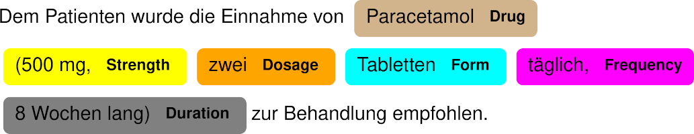

# GERNERMED - An Open German Medical NER Model

**Note:** The project repository will be updated upon acceptance.

## About
The is the project repository for **GERNERMED**, a named entity recognition (NER) model in the context of German medical natural language processing (NLP).  
In particular, **GERNERMED** is the first open neural NER model for medical entities designed for German data.

The following entities are supported:
- Drug
- Strength
- Route
- Form
- Dosage
- Frequency
- Duration

The evaluation scores on the test set are as follows:  

| NER Tag   | Precision | Recall | F1-Score |
|-----------|-----------|--------|----------|
| Drug      |     67.33 |  66.17 |    66.74 |
| Strength  |     92.34 |  90.99 |    91.66 |
| Route     |     89.93 |  90.14 |    90.04 |
| Form      |     91.94 |  89.24 |    90.57 |
| Dosage    |     87.83 |  87.57 |    87.70 |
| Frequency |     79.14 |  76.92 |    78.01 |
| Duration  |     67.86 |  52.78 |    59.37 |
| total     |     82.31 |  80.79 |    81.54 |

### NER Demonstration
<kbd></kbd>
                                                              
## Setup and Usage

For a quick test, run `python3 example.py` to run the NER model pipeline.

The package NER pipeline is available in `/data/de_GERNERMED-1.0.0.tar.gz` and can be installed by:  
```bash
# From local fs
python3 -m pip install ./data/de_GERNERMED-1.0.0.tar.gz

# From GitHub
python3 -m pip install https://github.com/frankkramer-lab/GERNERMED/blob/main/data/de_GERNERMED-1.0.0.tar.gz?raw=true
```  
The pipeline can be used in Python:  
```python
import spacy

nlp = spacy.load("de_GERNERMED")
doc = nlp("Dem Patienten wurde die Einnahme von Paracetamol (500 mg, zwei Tabletten täglich, 8 Wochen lang) zur Behandlung empfohlen.")

# Show entities
print(doc.ents)
```

## Reproducibility

The evaluation scores on the testset can be obtained by `./run_eval.sh`.  
The custom German dataset is stored in `/data/GERNERMED_dataset.json`.

## Citation

Please cite the following ArXiv paper from http://arxiv.org/abs/2109.12104

```
@misc{frei2021gernermed,
      title={GERNERMED -- An Open German Medical NER Model}, 
      author={Johann Frei and Frank Kramer},
      year={2021},
      eprint={2109.12104},
      archivePrefix={arXiv},
      primaryClass={cs.CL}
}
```
